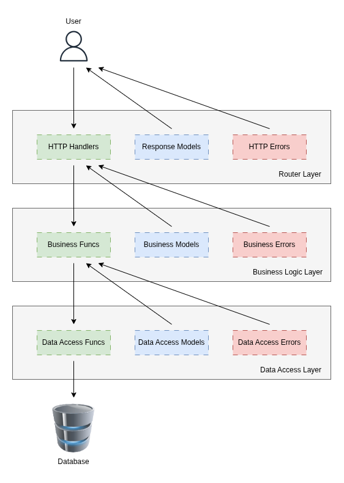

# FastAPI Repository Structure

This repository presents a scalable way to structure a RESTful FastAPI application.

<p align="center">
  
</p>

## Separation of Concerns in Three Layers

The **router** layer defines API endpoints, performs request validation via Pydantic, invokes functions from the business logic layer, and formats HTTP responses. The router layer response models define the shape of the data that is returned to the client. The router layer errors define erroneous responses.

The **business logic** layer contains the core application logic. This layer orchestrates workflows, enforces rules, and invokes functions from the data access layer to retrieve application data. The business logic layer sends data back to the router layer through business logic models and errors.

The **data access** layer is responsible for interacting with the database. This layer executes database queries and maps raw data to structured models via Pydantic. The data access layer sends data back to the business logic layer through data access models and errors.

This three-layered approach provides gaurd rails for organizing code by logical function, making large repositories easier to reason about.

## Domain-First Directory Structure

REST API's often expose endpoints for multiple business **domains**. A domain is simply a functional area of the API. (In this repository, the two example domains are `items` and `orders`.)

In many FastAPI projects, data models for all domains are placed in a single top-level directory at the root of the project. A quick search for “how to structure a FastAPI project” turns up many examples that look something like this:

```
my_fastapi_project/
├── app/
│   ├── __init__.py
│   ├── main.py
│   ├── dependencies.py
│   ├── routers/
│   │   ├── __init__.py
│   │   ├── users.py
│   │   └── items.py
│   ├── internal/
│   │   ├── __init__.py
│   │   └── admin.py
│   ├── core/
│   │   ├── __init__.py
│   │   ├── config.py
│   │   └── security.py
│   ├── models/
│   │   ├── __init__.py
│   │   ├── user.py
│   │   └── item.py
│   ├── schemas/
│   │   ├── __init__.py
│   │   ├── user.py
│   │   └── item.py
│   ├── services/
│   │   ├── __init__.py
│   │   ├── user_service.py
│   │   └── item_service.py
│   └── db/
│       ├── __init__.py
│       ├── database.py
│       └── migrations/
├── tests/
│   ├── __init__.py
│   ├── test_main.py
│   ├── test_users.py
│   ├── test_items.py
├── .env
├── .gitignore
├── requirements.txt
├── README.md
└── run.sh
```

More often than not, subdirectories are eventually added under `/models` and `/schemas` as the API grows. Similarly, router logic, such as `/routers/items.py`, may also be split into smaller files. Over time, this can make the repository harder to navigate because developers have to keep track of multiple directory structures for related code.

This repository argues for a different approach. By colocating data models with the code that uses them, rather than placing them in a separate, centralized directory, developers no longer need to maintain multiple directory trees for related code, making the project easier to navigate and evolve as it grows.

Within each layer, **domains** serve as the primary organizational unit. All related code—including models and errors—lives within the corresponding domain directory for that layer.

Consider, for example, the `data_access` directory. In this directory, there is a subdirectory for the items domain and the orders domain. In each domain, there are subdirectories for data models and errors alongside the data access code. A "common errors" directory is also present for universal data access errors, like a database error.

```
├── data_access
│   ├── errors                     <- Common data access errors
│   │   ├── database_error.py
│   │   └── __init__.py
│   ├── items                      <- Items domain
│   │   ├── errors                 <- Items data access errors
│   │   │   ├── __init__.py
│   │   │   └── item_not_found.py
│   │   ├── get_all_items.py      <- Items data access code
|   |   ├── get_item_by_id.py
│   │   ├── __init__.py
│   │   └── models                 <- Items data access models
│   │       ├── get_all_items.py
│   │       ├── get_item_by_id.py
│   │       └── __init__.py
│   └── orders                     <- Orders domain
│       ├── errors                 <- Orders data access errors
│       │   ├── __init__.py
│       │   └── order_not_found.py
│       ├── get_order_by_id.py     <- Orders data access code
│       ├── __init__.py
│       └── models                 <- Orders data access models
│           ├── get_order_by_id.py
│           └── __init__.py
```

Another advantage of organizing layers by domain is that each layer can follow the same general directory structure. This makes individual layers feel consistent and easier to work with, reducing cognitive load. Notice how the router layer directory looks almost identical to the data access layer directory:

```
└── routers
    ├── items                      <- Items domain
    │   ├── get_all_items.py      <- Items router code
    │   ├── get_item_by_id.py
    │   ├── __init__.py
    │   ├── response_models        <- Items response models
    │   │   ├── get_all_items.py
    │   │   ├── get_item_by_id.py
    │   │   └── __init__.py
    │   ├── test_get_all_items.py
    │   └── test_get_item_by_id.py
    └── orders                     <- Orders domain
        ├── get_order_by_id.py     <- Order router code
        ├── __init__.py
        ├── response_models        <- Orders response models
        │   ├── get_order_by_id.py
        │   └── __init__.py
        └── test_get_order_by_id.py
```

> [!NOTE]
> The logic for each layer is set up so that there is one function per file. This is a personal preference and not strictly necessary. For APIs with many endpoints, this layout helps prevent individual files from growing to thousands of lines in length.

## Testing

[Pytest](https://docs.pytest.org/en/stable/) is used for testing the API endpoints. Following the same philosophy as the rest of the repository, test case files are colocated with the code they cover.

A shared `conftest.py` overrides the `get_db` dependency, ensuring each test runs against a fresh database instance.

To run the tests:

```sh
uv run pytest
```

## Running the HTTP Server

Start the server using the following command:

```sh
uv run fastapi dev src/main.py
```

## When To Use This Structure (And When Not To)

I created this example repository because I was frustrated with the poor developer ergonomics of the FastAPI “best-practice” layouts like the one shown above, especially in larger codebases. In my view, this structure strikes a practical balance between organizing code by function—such as routing, business logic, and data access—and organizing it by business domain. Although it does introduce some repetition in directory structure across the three layers, I think that tradeoff is worthwhile because the layout stays consistent from one layer to the next.

If you’re building a proof of concept or your project only has a few domains, this repository structure will likely slow you down. For an MVP or a single-domain API, it’s usually better to stick with the simpler examples you see online. But if your API has many domains, or if you expect it to grow in scope over time, it may be worth investing up front in a more substantial organizational structure.
